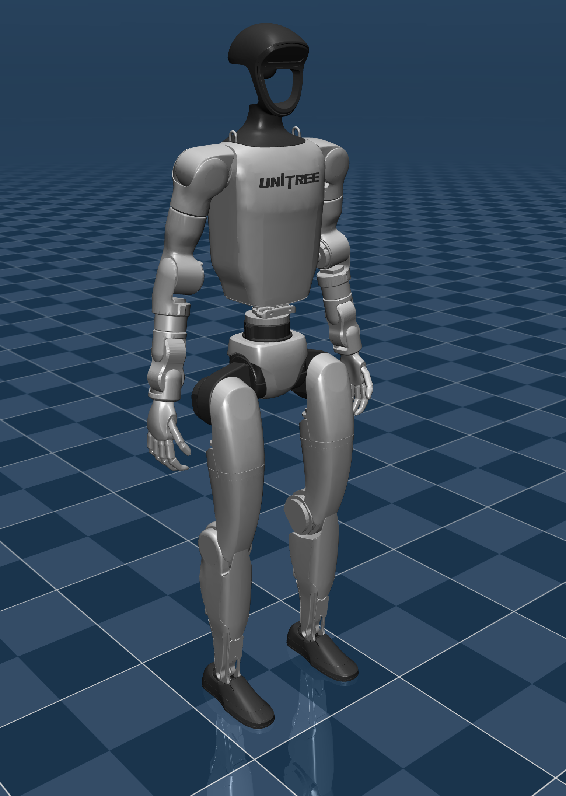
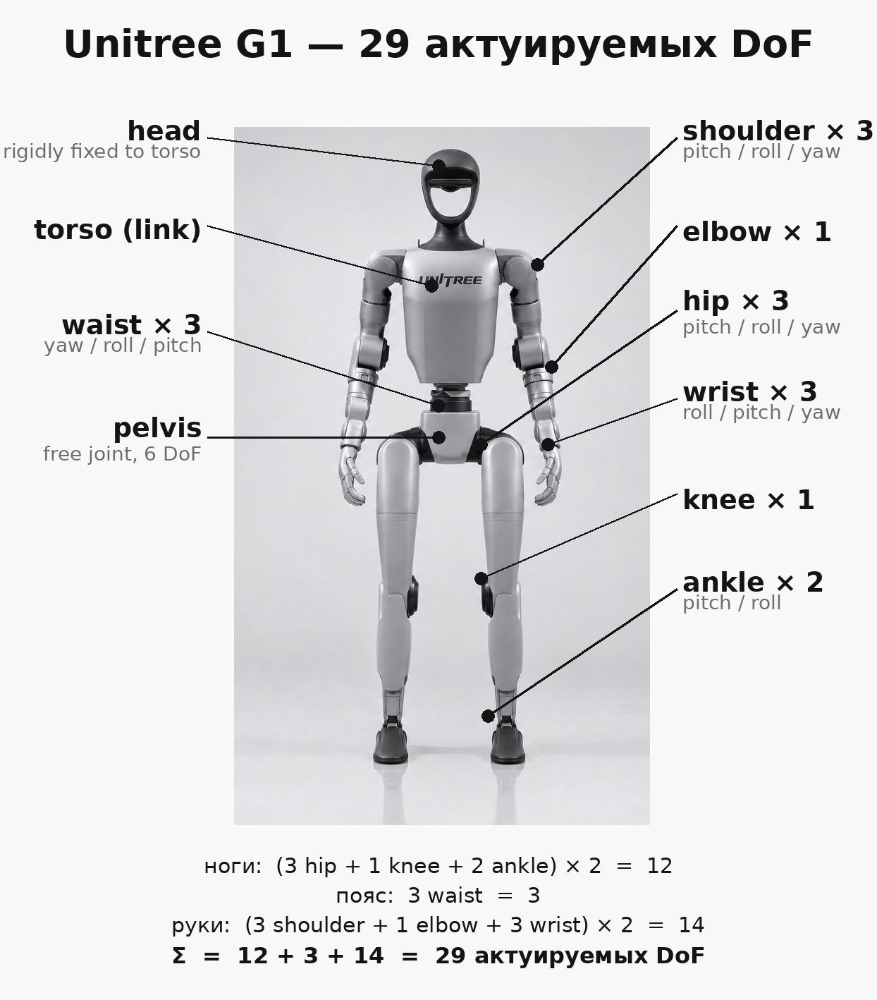
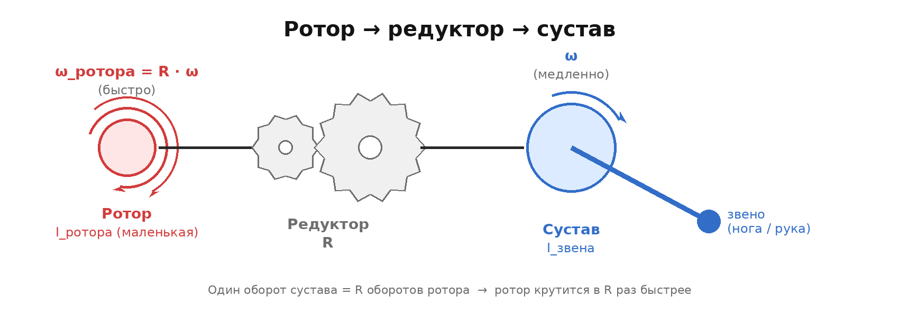
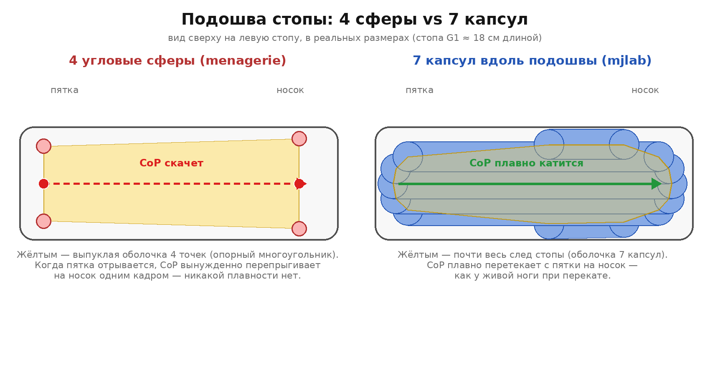

# Отчёт по проекту: RL-локомоция и акробатика для Unitree G1

> Это живой документ — он пишется параллельно работе. Сначала тут будет
> подробно разобрана **сама модель робота** (то, против чего обучается
> политика), потом — **постановка задачи и среда обучения**, потом —
> **алгоритмы**, и в конце — **результаты с обсуждением**. Все цифры
> в отчёте взяты из реальных артефактов репозитория (`assets/g1/*.xml`,
> исходников `mjlab`, директорий `runs/` и `docs/results/`); ничего не
> придумано «по памяти».

## Содержание

1. [Что мы вообще делаем](#1-что-мы-вообще-делаем)
2. [Робот Unitree G1 — обзор используемой модели](#2-робот-unitree-g1--обзор-используемой-модели)
   - 2.1 [Откуда взята модель](#21-откуда-взята-модель)
   - 2.2 [Какой XML реально подгружается при обучении](#22-какой-xml-реально-подгружается-при-обучении)
   - 2.3 [Что это за робот в реальной жизни](#23-что-это-за-робот-в-реальной-жизни)
   - 2.4 [Кинематика: 29 степеней свободы — откуда они берутся](#24-кинематика-29-степеней-свободы--откуда-они-берутся)
   - 2.5 [Масс-инерциальные характеристики](#25-масс-инерциальные-характеристики)
   - 2.6 [Приводы и предельные моменты](#26-приводы-и-предельные-моменты)
   - 2.7 [Диапазоны движения суставов](#27-диапазоны-движения-суставов)
   - 2.8 [Сенсоры на борту модели](#28-сенсоры-на-борту-модели)
   - 2.9 [Контактная модель и стопа](#29-контактная-модель-и-стопа)
   - 2.10 [MJX-вариант для GPU-симуляции](#210-mjx-вариант-для-gpu-симуляции)
   - 2.11 [Лицензия и цитирование](#211-лицензия-и-цитирование)
3. [Среда обучения и постановка задачи](#3-среда-обучения-и-постановка-задачи) *(в работе)*
4. [Алгоритмы](#4-алгоритмы) *(в работе)*
5. [Результаты](#5-результаты) *(в работе)*

---

## 1. Что мы вообще делаем

В двух предложениях: мы берём виртуальную копию реального человекообразного
робота **Unitree G1**, помещаем её в физический симулятор **MuJoCo** и
обучаем нейросетевую политику управлять этим телом сначала на простой
задаче (ходьба с заданной скоростью), а потом на более сложных
акробатических движениях — `spin kick`, `cartwheel`, `back-flip`. Когда
политика обучена, мы выгружаем её в формат **ONNX** (универсальный
бинарный формат для моделей машинного обучения) и проигрываем уже снаружи
тренировочного цикла, в обычном MuJoCo-вьюере, рулея командами с
клавиатуры. Это режим **sim-to-sim** — мы не запускаем робота в реальном
мире, но проверяем, что обученная сеть продолжает работать в чужом
рантайме (без знания о том, как именно её обучали).

Параллельно идёт сравнительная часть: мы обучаем одну и ту же задачу
ходьбы тремя разными RL-алгоритмами (**PPO**, **PPO + AMP**, **ARS**;
плюс опционально **SAC**) и потом смотрим, кто что умеет на одинаковых
метриках. Подробный план этой сравнительной части лежит в
`docs/algorithm_comparison_roadmap.md`, шаблон финального отчёта по ней —
в `docs/results/comparison_report.md`. А этот файл, `REPORT.md`, —
**верхнеуровневый рассказ от первого лица**, читаемый сверху вниз: от
«что у нас вообще за робот и почему именно он» до «что в итоге
получилось и где видео».

Вся инфраструктурная обвязка (Docker, Makefile, ONNX-экспорт, скрипт
скачивания ассетов и т.д.) описана в `README.md` корня проекта; здесь
её повторять смысла нет. Здесь — содержательная часть исследования.

---

## 2. Робот Unitree G1 — обзор используемой модели

<p align="center">
  
</p>

<p align="center">
  <em>Рисунок 1. Базовая 29-DoF MJCF-модель Unitree G1 (`g1.xml`) — именно
  на этой ревизии («`g1_29dof_rev_1_0`», без подвижных кистей и пальцев)
  выполняется всё обучение в этом проекте. Рендер в нативном разрешении
  3840×2160 лежит прямо в репозитории и взят из MuJoCo Menagerie.</em>
</p>

Прежде чем говорить про алгоритмы, важно понять, **что вообще видит
политика и каким миром она манипулирует**. В RL-локомоции «модель» — это
не одно число и не одна сетка; это целая физическая абстракция:
геометрия тела, массы, инерции, моторы, лимиты по углам и моментам,
датчики. Если хоть одна из этих характеристик не совпадает с реальной
жизнью, политика, обученная в симуляторе, при переносе на железо
рассыпается. Поэтому весь раздел 2 — это аккуратная экскурсия по тому,
что зашито в наш XML-файл с описанием робота.

### 2.1 Откуда взята модель

Чтобы можно было воспроизвести наши эксперименты, важно понимать
происхождение модели — кто и где её сделал. В нашем случае это **цепочка
из трёх звеньев**, каждое из которых публично и версионируемо:

1. **Unitree Robotics** — производитель железа — публикует официальное
   описание робота в формате URDF (Unified Robot Description Format,
   стандарт ROS) в open-source репозитории
   [`unitreerobotics/unitree_ros`](https://github.com/unitreerobotics/unitree_ros/blob/master/robots/g1_description/g1_29dof_rev_1_0.xml).
   Конкретно нас интересуют файлы `g1_29dof_rev_1_0.xml` и
   `g1_29dof_with_hand_rev_1_0.xml`. Это **первоисточник**: именно отсюда
   приходят массы, тензоры инерции, оси шарниров и предельные моменты
   моторов. Любая последующая правка — это правка над этим набором.
2. **Google DeepMind** в проекте
   [`mujoco_menagerie`](https://github.com/google-deepmind/mujoco_menagerie)
   аккуратно конвертирует это URDF в **MJCF** — родной формат описания
   модели для MuJoCo. По дороге они выносят общие свойства в секцию
   `<default>` (чтобы не дублировать), добавляют обвязку для
   `position`-актуаторов (то есть превращают «суставы» в «суставы под
   управлением PD-регулятора»), готовят keyframe `stand` (поза по
   умолчанию для смоук-тестов) и заодно делают отдельный MJX-вариант с
   упрощёнными коллайдерами под GPU. История правок видна в
   `assets/g1/CHANGELOG.md`: последняя сверка с upstream Unitree
   датирована **10 декабря 2024 г.** (sha
   `c20ca8f1fe5e519474c6c8d10b1ce5c719dd7a65`), а тонкая правка лимита
   правого тазобедренного roll-сустава под уточнённые ограничения
   реального железа — **7 августа 2025 г.**
3. **Наш репозиторий** забирает из Menagerie только подкаталог
   `unitree_g1` через **sparse-checkout** — это git-механизм, который
   позволяет клонировать только часть большого репозитория. В нашем
   случае это даёт ~30 МБ вместо ~1 ГБ всей коллекции зоопарка моделей:

```13:24:scripts/setup_assets.sh
MENAGERIE_URL="https://github.com/google-deepmind/mujoco_menagerie.git"
MENAGERIE_REF="${MENAGERIE_REF:-main}"

mkdir -p "${THIRD_PARTY}" "${ASSETS}"

if [[ ! -d "${THIRD_PARTY}/mujoco_menagerie/.git" ]]; then
    echo "[assets] cloning MuJoCo Menagerie (sparse, only unitree_g1) ..."
    git -C "${THIRD_PARTY}" clone --depth 1 --branch "${MENAGERIE_REF}" \
        --filter=blob:none --no-checkout "${MENAGERIE_URL}"
    git -C "${THIRD_PARTY}/mujoco_menagerie" sparse-checkout init --cone
    git -C "${THIRD_PARTY}/mujoco_menagerie" sparse-checkout set unitree_g1
    git -C "${THIRD_PARTY}/mujoco_menagerie" checkout "${MENAGERIE_REF}"
```

После запуска `make assets` в `assets/g1/` оказывается следующий набор
файлов:

| Файл | Что это и зачем |
|---|---|
| `g1.xml` | Базовая 29-DoF модель без пальцев. Используется для документации и для деплоя готовой политики (`otus-play`). |
| `g1_with_hands.xml` | То же тело + по 5 пальцев на каждой руке. Лежит «на будущее» — для манипуляционных задач. В наших обучениях не используется. |
| `g1_mjx.xml` | Версия с упрощёнными коллайдерами и более реалистичными PD-настройками, заточенная под MJX (см. §2.10). |
| `scene*.xml` | Простые сцены (плоский пол + источник света) — обёртка вокруг робота для smoke-тестов. |
| `assets/*.STL` | Меши всех звеньев — это та самая «3D-геометрия» в виде треугольников, ~3,5 МБ суммарно. |
| `LICENSE` | BSD-3-Clause (см. §2.11). |

Главный вывод по происхождению такой: мы **никак не правим модель сами**
и не пишем «домашнюю переразметку» под себя. Мы стоим на плечах двух
авторитетных upstream-источников (производитель + DeepMind), каждый из
которых даёт нам подписанный лицензией, версионируемый артефакт. Это
важно для воспроизводимости: достаточно зафиксировать переменную
`MENAGERIE_REF` (по умолчанию `main`), и любой другой человек в любой
момент получит ровно ту же физическую модель, против которой обучались
мы.

### 2.2 Какой XML реально подгружается при обучении

Тут есть тонкий, но важный нюанс, который легко упустить. Когда мы
запускаем обучение через `otus-train`, **симулятор грузит не файл из
`assets/g1/`**, а собственную копию `g1.xml`, лежащую внутри пакета
`mjlab` (это RL-фреймворк уровня Isaac Lab, но поверх MuJoCo и
MuJoCo-Warp). Конкретное место — `mjlab/asset_zoo/robots/unitree_g1/`,
и именно эта копия упоминается в его
[конфиг-модуле `g1_constants.py`](https://github.com/mujocolab/mjlab/blob/main/src/mjlab/asset_zoo/robots/unitree_g1/g1_constants.py):

```python
G1_XML: Path = (
  MJLAB_SRC_PATH / "asset_zoo" / "robots" / "unitree_g1" / "xmls" / "g1.xml"
)
assert G1_XML.exists()
```

Что важно понимать про эту копию:

- Это **тот же базовый робот** — `<mujoco model="g1_29dof_rev_1_0">`, те
  же 29 актуируемых суставов, те же массы и инерции, те же диапазоны
  углов. То есть всё, что написано в §§ 2.4–2.7 ниже, остаётся в силе.
- Но **стопа описана иначе**: вместо четырёх сфер по углам подошвы
  (как в menagerie-`g1.xml`) здесь 7 капсульных коллайдеров на каждую
  ногу (`left_foot1_collision` … `left_foot7_collision`), что ближе к
  MJX-варианту от DeepMind. Сама геометрия и **подробное обоснование,
  почему капсулы лучше угловых сфер для GPU-обучения** — в §2.9 (см.
  врез «Почему 4 сферы заменили на 7 капсул»).
- И самое важное — **актуаторы и PD-параметры описаны не в самом XML**,
  а собираются программно отдельным модулем `g1_constants.py`. Этот
  модуль берёт реальные характеристики моторов Unitree (есть четыре
  разные серии: 5020 для рук, 7520-14 для тазобедренных pitch/yaw и
  поясничного yaw, 7520-22 для самых нагруженных hip-roll и колен,
  4010 для слабых кистевых) и считает жёсткости/демпфирование по
  «электромеханической» формуле через целевую натуральную частоту 10 Гц
  и коэффициент затухания 2,0 (то есть **с двукратным запасом
  критического демпфирования** — приводы заведомо не «звенят»).
  Подробное обоснование этой схемы — в §2.6 (см. врез «Почему PD задаются
  программно, а не прямо в XML»).

Иначе говоря: `assets/g1/g1.xml` — это **референс-документация и
deploy-копия**, а боевой путь обучения проходит через `mjlab`-копию.
Цифры в этом отчёте я честно беру из обоих источников; везде, где это
имеет значение, я отдельно говорю, какой именно файл используется.

### 2.3 Что это за робот в реальной жизни

Unitree G1 — серийный антропоморфный робот среднего размера. Анонсирован
в **мае 2024 года** и сразу был выведен на рынок как «образовательная»
платформа: целевая аудитория — научные группы, стартапы и
RL-исследователи, которым нужен реальный гуманоид без бюджета Boston
Dynamics. Базовые публичные характеристики реального железа (по
[странице производителя](https://www.unitree.com/g1/)):

| Параметр | Значение |
|---|---|
| Высота в стойке | ~1,32 м |
| Сухой вес (без батареи в таре) | ~35 кг |
| Степени свободы | 23 базовых / **29** в расширенной версии (наша) / 43 с подвижными пальцами |
| Пиковый момент в колене | до 120 Н·м |
| Скорость ходьбы | до ~2 м/с |
| Аккумулятор | 9000 мА·ч, ~2 часа автономии |
| Базовая стоимость | от ~16 000 USD за educational-комплект |

Симуляционная модель в `assets/g1/` отражает именно **29-DoF ревизию
1.0** без пальцев. Это базовая конфигурация, оптимальная для задач
локомоции и whole-body-движений: у тела всё, что нужно, чтобы ходить,
бегать, прыгать и крутиться, но нет лишних мелких суставов кистей,
которые сделали бы пространство действий шире, тренировку дольше, а
выигрыш в локомоционных задачах — нулевым. Версия с пальцами лежит в
репозитории как задел под будущие манипуляционные эксперименты, но во
всех текущих наших средах она не загружается.

### 2.4 Кинематика: 29 степеней свободы — откуда они берутся

«29 DoF» звучит абстрактно, поэтому давайте разложим. **Степень свободы
(degree of freedom, DoF)** — это один независимый параметр, описывающий
конфигурацию тела. У точки в 3D их 3 (x, y, z). У твёрдого тела в
пространстве — 6 (3 поступательных + 3 вращательных). У робота их
столько, сколько **независимых шарниров**, плюс 6 на положение всего
тела в мире, если оно «не привинчено» к чему-то.

В нашей MJCF-модели корневое тело — `pelvis` (таз) — крепится к мировой
системе **свободным шарниром** (`<freejoint>`). Это специальный тип
шарнира в MuJoCo, который добавляет к телу 6 степеней свободы (3
поступательных и 3 вращательных). Получается «плавающая база» — таз
может находиться в любой точке пространства, под любым углом. Это и есть
способ описать «робот стоит/лежит/летит в воздухе». Эти 6 DoF
**не управляются политикой**: моторов в тазу нет, эта степень свободы
существует, чтобы симулятор мог двигать робота под действием физики
(гравитация, контакты со стопами, толчки извне).

Дальше от таза вверх и вниз отходят пять кинематических ветвей. Общее
число **актуируемых** (то есть таких, которыми политика реально может
управлять через моторы) суставов — 29. Картина по группам:

<p align="center">
  
</p>

<p align="center">
  <em>Рисунок 2. Тот же G1, что и на Рис. 1, только анфас и в более парадном
  продакт-шот стиле — поверх него подписаны все группы суставов, чтобы
  было видно, где у робота что крутится. На каждой руке по 7 шарниров
  (3 в плече, 1 в локте, 3 в запястье), на каждой ноге по 6 (3 в бедре,
  1 в колене, 2 в голеностопе), плюс 3 в поясе — это и есть наши 29
  управляемых DoF. Голова к торсу прикручена жёстко и в это число не
  входит. Отдельно помечен <code>pelvis</code> — это не управляемый
  сустав, а «плавающая база» (free joint): она добавляет ещё 6 DoF на
  положение всего робота в мире, но крутит ими физика — гравитация,
  контакты со стопами, толчки извне, — а не политика.</em>
</p>

Арифметика простая: **6 (нога) × 2 + 3 (пояс) + 7 (рука) × 2 = 29**.

Под капотом MuJoCo это даёт следующие размерности, которые нам понадобятся
дальше (например, при описании размера выхода нейросети-политики):

- **Действие политики** — 29-мерный вектор. Каждое его число — это
  *целевая позиция* для соответствующего сустава, которую дальше
  реализует PD-регулятор внутри симулятора (см. §2.6).
- **Обобщённые координаты `qpos`** — вектор размера 7 + 29 = **36**.
  «Лишние» 7 — это XYZ-позиция таза в мире (3 числа) плюс кватернион
  ориентации (4 числа). Кватернион — это «компактная» альтернатива
  углам Эйлера; он не страдает от gimbal lock и потому стандартен в
  робототехнике.
- **Обобщённые скорости `qvel`** — вектор размера 6 + 29 = **35**.
  Лишние 6 — линейная (3 числа) и угловая (3 числа) скорости таза. То
  есть скоростей на одну меньше, чем координат, потому что три
  компоненты угловой скорости описывают изменение четырёхкомпонентного
  кватерниона.

### 2.5 Масс-инерциальные характеристики

В MJCF каждое звено робота несёт собственный блок `<inertial>` —
описание его «инертных» свойств. Это два числа на звено по сути: масса
(в кг) и **тензор инерции** (в кг·м²). Тензор инерции — это мера того,
насколько тяжело раскрутить данное тело относительно разных осей:
большое значение по оси Z, например, означает, что вокруг этой оси тело
крутить тяжело. В MJCF тензор хранится **в диагонализованном виде**:
сначала кватернион главных осей (т.е. в каких направлениях главные оси
этого тензора смотрят в локальной системе звена), а потом три числа —
моменты инерции вдоль этих главных осей. Такой формат намного
компактнее полной 3×3-матрицы и удобнее для численных решателей.

Ниже — сводная таблица всех 25 звеньев робота (значения берутся прямо
из `assets/g1/g1.xml`, эта же геометрия используется в mjlab-копии,
поэтому числа корректны и для тренировки):

| Звено | Масса, кг | Главные моменты инерции (×10⁻³ кг·м²) |
|---|---:|---|
| `pelvis` | **3,813** | 10,5 / 9,3 / 7,9 |
| `torso_link` | **7,818** | 121,8 / 109,8 / 27,4 |
| `waist_yaw_link` | 0,214 | 0,16 / 0,11 / 0,10 |
| `waist_roll_link` | 0,086 | 0,008 / 0,007 / 0,006 |
| `*_hip_pitch_link` (×2) | 1,350 | 1,82 / 1,53 / 1,16 |
| `*_hip_roll_link` (×2) | 1,520 | 2,55 / 2,41 / 1,49 |
| `*_hip_yaw_link` (×2) | 1,702 | 7,76 / 7,18 / 1,60 |
| `*_knee_link` (×2) | 1,932 | 11,38 / 11,28 / 1,46 |
| `*_ankle_pitch_link` (×2) | 0,074 | 0,019 / 0,014 / 0,007 |
| `*_ankle_roll_link` (×2) | 0,608 | 1,67 / 1,62 / 0,22 |
| `*_shoulder_pitch_link` (×2) | 0,718 | 0,47 / 0,43 / 0,41 |
| `*_shoulder_roll_link` (×2) | 0,643 | 0,69 / 0,62 / 0,39 |
| `*_shoulder_yaw_link` (×2) | 0,734 | 1,06 / 1,03 / 0,40 |
| `*_elbow_link` (×2) | 0,600 | 0,44 / 0,42 / 0,26 |
| `*_wrist_roll_link` (×2) | 0,085 | 0,055 / 0,050 / 0,036 |
| `*_wrist_pitch_link` (×2) | 0,484 | 0,43 / 0,43 / 0,16 |
| `*_wrist_yaw_link` (×2) | 0,255 | 0,65 / 0,56 / 0,15 |

Если просуммировать массы по всему телу, получается **~33,5 кг**. Это
хорошо согласуется с заявленным «сухим» весом реального G1 в 35 кг.
Разница в полтора килограмма объясняется просто: в MJCF не моделируются
батарея, кабельные жгуты, обшивка корпуса и система охлаждения, а
жёстко-прикреплённая голова отнесена к массе торса (отдельного `head`
звена с собственной массой нет).

Распределение массы характерно для антропоморфного робота:
**~12 кг** в тазово-торсном «корпусе» (`pelvis` + `torso_link` + пояс);
**~14 кг** в ногах (примерно по 7 кг на ногу); **~7 кг** в руках. Ноги
тяжёлые в верхней части (бедро + колено), а кисти и стопы — лёгкие; это
обычная и желательная конструкция, потому что низкоинертные дистальные
звенья проще быстро двигать (важно для динамичных движений вроде удара
ногой).

Отдельно стоит обратить внимание на **поясничный механизм**:
`waist_yaw_link` и `waist_roll_link` весят 0,214 и 0,086 кг — почти
ничто. И это при том, что через них проходит весь крутящий момент
торса. На практике там стоит маленький карданный механизм, в котором
сами звенья почти невесомы, но через них передаётся большой момент, а
почти вся масса торса висит на этом «суставе». Для симулятора это
совершенно нормально, но для интуиции полезно знать.

### 2.6 Приводы и предельные моменты

«Привод» (actuator) в робототехнике — это интерфейс, через который мозг
управляет конкретным мотором. В нашей задаче все 29 шарниров
управляются **позиционно**: политика выдаёт целевой угол `q*`, а
встроенный в симулятор PD-регулятор сам считает, какой крутящий момент
надо приложить, чтобы туда дойти. Формула стандартная:

`τ = kp · (q* − q) − kd · q̇`

Здесь `q` и `q̇` — текущие угол и угловая скорость сустава, `kp` —
жёсткость пружины (как сильно регулятор «тянет» в сторону цели), `kd` —
демпфирование (как сильно регулятор гасит скорость, чтобы не было
колебаний). Это и есть та самая PD-регулировка из любого учебника по
автоматическому управлению; в MuJoCo она пересчитывается каждый шаг
интегрирования.

Дальше в этом разделе — как именно конкретные числа `kp`, `kd`,
`armature`, `torque_limit` для G1 получаются в нашем обучении.

#### Шаг 1. В G1 четыре серии моторов, и они задают «сырые» цифры

Unitree публикует паспорт на каждый мотор: момент инерции каждой
ступени ротора, передаточные числа двухступенчатой планетарной
редукции, пиковый момент, максимальная скорость. В G1 используются
четыре серии моторов; они стоят в разных местах и отличаются по силе:

| Серия мотора | `torque_limit`, Н·м | `velocity_limit`, рад/с | Где стоит |
|---|---:|---:|---|
| **5020** | 25 | 37 | плечи (pitch/roll/yaw), локоть, wrist-roll |
| **4010** | 5 | 22 | wrist-pitch, wrist-yaw |
| **7520-14** | 88 | 32 | hip-pitch, hip-yaw, waist-yaw |
| **7520-22** | 139 | 20 | hip-roll, knee |

Это и есть исходные данные. Всё остальное (PD-коэффициенты, эффективная
инерция приведённого ротора) считается из них формулами в шагах 2–4
ниже.

#### Шаг 2. Эффективная инерция ротора → `armature`

Сначала — **что мы вообще пытаемся посчитать и зачем**. Внутри каждого
мотора Unitree крутится **ротор** — маленькая железяка массой меньше
сотни граммов и собственной инерцией порядка единиц-десятков
**микро-**кг·м². Сам по себе он почти ничего не весит. Но между
ротором и выходным валом сустава стоит **редуктор** с большим
передаточным числом — один оборот сустава = много оборотов ротора, —
и из-за этого ротор для сустава ощущается **гораздо тяжелее**, чем он
есть на самом деле. Чтобы симуляция честно отражала, как сустав
разгоняется и тормозит, нам нужно посчитать эту «эффективную»
инерцию — её и зовут `armature`.

<p align="center">
  
  <br/>
  <em>Рисунок 4. Механика одного сустава: маленький лёгкий ротор
  (слева, <code>I_ротора</code>, крутится быстро со скоростью
  <code>ω_ротора = R · ω</code>) через редуктор с передаточным числом
  <code>R</code> вращает выходной вал сустава (справа, медленно
  со скоростью <code>ω</code>), к которому уже прикреплено звено —
  нога или рука. Один оборот сустава = R оборотов ротора.</em>
</p>

Школьная физика тут работает так. Пусть редуктор имеет передаточное
число `R`: один оборот сустава = `R` оборотов ротора. Тогда, если сустав
крутится со скоростью `ω`, ротор крутится в `R` раз быстрее — со
скоростью `R·ω`. Запишем кинетическую энергию ротора:

```
KE_ротора = ½ · I_ротора · ω_ротора²
          = ½ · I_ротора · (R·ω)²
          = ½ · (R² · I_ротора) · ω²
```

где `I` — момент инерции (вращательный аналог массы, измеряется в
кг·м²). А теперь — **главный шаг**. Любое тело, которое крутилось бы
вокруг сустава с самой скоростью сустава `ω`, имело бы кинетическую
энергию `½ · I · ω²` со своей инерцией `I`. Сравним эти две
формулы — у нас тоже получилось `½ · (что-то) · ω²`:

```
KE_ротора     =  ½ · (R² · I_ротора) · ω²        ← через скорость ротора
KE_у_сустава  =  ½ · I_эффективная     · ω²        ← через скорость сустава
```

Раз оба выражения описывают **одну и ту же** энергию (это всё та же
крутящаяся железяка, просто посчитанная в разных переменных), они
обязаны быть равны. Сравнивая множители при `ω²`, получаем:

```
I_эффективная_у_сустава = R² · I_ротора
```

Это и есть «эффективная» инерция ротора, видимая со стороны сустава.
Квадрат тут — естественное следствие того, что **скорость ротора в `R`
раз больше скорости сустава, а энергия растёт как квадрат скорости**.
Поэтому даже маленький быстрый ротор за большой редукцией становится
для сустава **очень заметным маховиком**: с его точки зрения сустав
ведёт себя так, будто к нему прицеплено тело с инерцией `R² · I_ротора`,
крутящееся со скоростью самого сустава. Эту виртуальную инерцию MuJoCo
и записывает в параметр `armature`.

В G1 редуктор не одноступенчатый, а **двухступенчатый**: ротор →
промежуточная шестерня → выходной вал. Это значит, что в цепочке
крутятся **три** вращающиеся части — сам ротор, промежуточная шестерня
и выходной вал — и у каждой своя инерция и своё «расстояние» до
выходного вала в передаточных числах. Считаем по частям:

- **первая ступень** (на самом моторе) видит **обе** передачи —
  умножается на квадрат **их произведения**;
- **вторая ступень** (промежуточная шестерня) — только на последнюю
  передачу, в квадрате;
- **третья ступень** (на выходном валу) уже крутится с той же
  скоростью, что и сустав, — без умножения.

Эту арифметику с тремя инерциями и двумя передачами один раз
аккуратно реализовали в mjlab в виде помощника
`reflected_inertia_from_two_stage_planetary`: на вход — три инерции и
два передаточных числа, на выход — одно число `armature` для сустава.

**Конкретно для серии 5020** (плечи, локоть, wrist-roll) вход выглядит
так:

- **инерции трёх ступеней:** `(0,139; 0,017; 0,169) × 10⁻⁴` кг·м² —
  буквально единицы граммов железа в роторе и шестернях;
- **передаточные числа двух ступеней:** `1 + 46/18 ≈ 3,55` и
  `1 + 56/16 ≈ 4,5`, общая редукция мотор → сустав примерно **16 : 1**.

Сложив всё с правильными квадратами, получаем `armature ≈ 4 × 10⁻³`
кг·м². Чтобы оценить, **много это или мало**: это столько же, сколько
у небольшого **стального диска массой ~1 кг и диаметром ~18 см**,
насаженного прямо на вал плеча. Сам ротор весит десятки граммов, но
через редукцию сустав «чувствует» его именно как такой диск. У серии
**7520-22** (колено, hip-roll), где редукция уже 22 : 1 и сам ротор
крупнее, эффективная инерция выходит примерно `2,5 × 10⁻²` кг·м² —
ещё в 6 раз больше, и она доминирует над инерцией самой голени.

Это число потом записывается в MuJoCo как параметр `armature`
соответствующего сустава и **добавляется к настоящей инерции звена** в
уравнениях движения. Без него симулятор считал бы, что сустав почти
невесомый и его можно разгонять как угодно быстро; с ним — физика
честно учитывает, что в каждом суставе сидит мотор, который тоже
что-то весит, тормозит, и который не даёт мгновенно поменять скорость
сустава.

#### Шаг 3. Две человекопонятные ручки → `kp` и `kd`

Дальше mjlab выбирает не сами `kp`/`kd`, а **два инженерных параметра
замкнутой системы**, которые имеют физический смысл:

- **Натуральная частота** регулятора `NATURAL_FREQ = 10 Гц` (в формулах
  `ω₀ = 10 · 2π ≈ 62,8 рад/с`). Это «как быстро регулятор
  должен догонять цель». 10 Гц — заведомо быстрее, чем 50-Гц шаг
  политики, но не настолько быстро, чтобы требовать микро-шага
  интегрирования.
- **Коэффициент затухания** `DAMPING_RATIO = 2.0`. Это «насколько
  демпфирована замкнутая система»; 1,0 — критическое демпфирование
  (минимально достаточное, чтобы не было колебаний), а 2,0 —
  **двукратное критическое**, с запасом: даже шумные команды политики
  не вызывают «звон».

Из этих двух чисел и `armature` PD-коэффициенты считаются по формулам
обычного линейного гармонического осциллятора:

```
kp = armature · ω₀²
kd = 2 · ζ · armature · ω₀
```

Жёсткость и демпфирование, которые получаются, **отличаются для каждой
из четырёх серий**, потому что у них разная `armature`. Например, для
маленького 5020 (плечо) `kp` оказывается порядка единиц-десятков Н·м/рад,
а для большого 7520-22 (колено) — около сотни. Это и есть «каждому
мотору — своя жёсткость, но одинаковая замкнутая динамика»: все 29
суставов имеют одну и ту же натуральную частоту 10 Гц и один и тот же
коэффициент затухания 2,0, несмотря на 30-кратную разницу в моменте.

#### Шаг 4. Параллельные 4-bar-механизмы — двойной счёт

В G1 голеностопы и поясничные оси `roll`/`pitch` — это **параллельные
кинематические линки**: один сустав крутится сразу **двумя моторами
5020**. mjlab учитывает это явно: для этих суставов `armature`,
`kp`, `kd` и `torque_limit` умножаются на 2 — как если бы стояли два
параллельных идентичных привода. Поэтому, например, у голеностопа
`pitch` `torque_limit` получается **±50 Н·м** (2 × 25), а не 25.

#### Шаг 5. Что в итоге попадает в MuJoCo

Каждому из 29 суставов mjlab выставляет четыре числа: `kp`, `kd`,
`armature`, `torque_limit`. Все они — производные от мотор-серии,
сидящей в этом суставе, и от двух глобальных ручек (`NATURAL_FREQ`,
`DAMPING_RATIO`). Дальше MuJoCo на каждом шаге симуляции для каждого
сустава вычисляет:

```
                     ┌─ от регулятора ─┐   ┌─ от трения ──┐
τ_к_суставу_total =  kp·(q* − q) − kd·q̇  −  frictionloss·sign(q̇)
```

и подставляет это в правую часть уравнений движения, где `armature`
уже учтено в эффективной инерции сустава. Полная картина для одного
сустава, чтобы было видно, **где какой параметр живёт**:

- **`kp`** — в PD-члене регулятора, явно.
- **`kd`** — в PD-члене регулятора, явно. В реальности задаётся не
  напрямую, а через эквивалентный параметр `dampratio` в MuJoCo:
  симулятор сам пересчитывает `kd` так, чтобы получить нужное затухание
  замкнутой системы (с учётом `armature` и инерции звена).
- **`armature`** — **не в формуле PD**, а в инерционном члене общих
  уравнений движения. От него зависит, как быстро сустав отвечает на
  любой приложенный момент.
- **`frictionloss`** — отдельный член `−frictionloss · sign(q̇)`,
  моделирующий кулоновское трение (то самое «залипание», когда нужно
  преодолеть постоянный порог, чтобы сустав вообще тронулся).
- **`torque_limit`** — жёсткое насыщение: что бы ни вычислил регулятор,
  на сустав не уйдёт момент больше этого значения. Это физика самих
  моторов, и нарушить её политика не может.

Если совсем коротко: **PD — это `kp` и `kd`**, а **`armature` и
`frictionloss` — это про физику самого сустава**, а не про регулятор.
Они меняют ответ системы на тот момент, который выдал регулятор, но
сами в формулу регулятора не входят.

> *Сноска про menagerie-вариант.* Если открыть `assets/g1/g1.xml` (тот,
> что мы используем для деплоя и просмотра в обычном MuJoCo-вьюере),
> там стоят «плоские» дефолты для всех суставов сразу: `kp=500`,
> `dampratio=1`, `armature=0,01`, `frictionloss=0,3`. Это разумные
> smoke-test-числа, и для просмотра готовой политики их хватает, но
> в обучении мы их **не используем** — обучение идёт на основе
> mjlab-копии XML и описанной выше программной обвязки на её
> актуаторах (см. §2.2).

#### Почему PD задаются программно, а не прямо в XML

На первый взгляд это выглядит как лишний слой абстракции — XML и так
поддерживает теги `kp`/`kv`/`armature`, можно было бы написать туда 29
чисел и не плодить отдельный Python-модуль. На практике у программного
подхода в `g1_constants.py` есть несколько серьёзных причин, и они
складываются:

- **Один источник правды — реальный мотор-каталог.** В G1 стоят моторы из
  четырёх разных серий, и у каждой серии Unitree публикует паспорт:
  момент инерции ротора, передаточные числа двухступенчатой планетарки,
  пиковый момент, максимальная скорость. В коде эти числа объявлены
  **по одному разу** как константы (`ROTOR_INERTIAS_5020`, `GEARS_5020`,
  `ACTUATOR_5020.torque_limit = 25.0` и т.д.), и из них уже выводится
  всё остальное. В XML пришлось бы 29 раз руками вписывать `kp`, `kd`,
  `armature`, `forcerange`, и поддерживать их синхронность с
  паспортами. Любое уточнение от Unitree означало бы 29 одинаковых
  правок в XML и риск рассинхрона.
- **Физически грамотный выбор жёсткостей.** Жёсткость берётся не «от
  балды», а по формуле линейного гармонического осциллятора:
  `kp = armature · ω₀²` и `kd = 2 · ζ · armature · ω₀`, где `ω₀` — целевая
  натуральная частота регулятора, а `ζ` — коэффициент затухания. То есть
  инженер выбирает не «магические kp», а **два человекопонятных
  параметра**: «как быстро регулятор должен догонять цель» (10 Гц = время
  отклика около 16 мс — заведомо быстрее, чем 50-Гц шаг политики, но не
  настолько быстро, чтобы требовать микро-шага интегрирования) и
  «насколько демпфировано» (2.0 = двукратное критическое = заведомо без
  колебаний). Эти два числа дают **одинаковую замкнутую динамику** всем
  29 суставам, несмотря на то, что моторы у них отличаются по моменту
  почти в 30 раз. С хардкодом kp в XML такую инвариантность поддержать
  было бы дико сложно.
- **Reflected inertia честно считается из передачи.** Функция
  `reflected_inertia_from_two_stage_planetary` принимает инерции трёх
  ступеней мотора и две передаточные пары и выдаёт **эффективную
  инерцию ротора, приведённую к выходному валу**. Это более правдивая
  цифра, чем `armature=0.01` «потому что хорошее число» в menagerie-XML.
- **Параллельные кинематические линки.** Голеностопы и
  `waist_pitch`/`waist_roll` в G1 — это **4-bar linkages**: один сустав
  крутится **двумя моторами 5020 параллельно**. В коде это решается
  одной строкой («умножь жёсткость, демпфирование, armature и
  torque-limit на 2»), и в комментарии прямо это объясняется. В XML
  либо пришлось бы дублировать поля и держать их в синхроне руками, либо
  вообще нельзя было бы выразить чисто — без правки топологии модели.
- **Тривиальные ablation-эксперименты.** Если завтра захочется сравнить
  обучение с **жёсткими и мягкими приводами** — меняешь *одну
  строчку* (`NATURAL_FREQ = 5 * 2π` вместо `10 * 2π`), и все 29
  шарниров согласованно перестраиваются. С XML пришлось бы либо писать
  миграционный скрипт, либо держать рядом несколько XML-вариантов и
  следить, чтобы между ними не разъехалась геометрия.
- **Один и тот же код на несколько ревизий робота.** Завтра выйдет
  G1-Pro или 23-DoF-вариант — `g1_constants.py` тривиально
  переиспользуется (поменяется только список суставов и какие на них
  стоят моторы). XML-конфиги для каждой ревизии пришлось бы делать с
  нуля.

Цена за всё это — что параметры PD не видны прямо в XML, и чтобы их
посмотреть, надо открыть `g1_constants.py`. Для production-проекта это
абсолютно правильный размен: добавляется один файл документации, но
снимается целый класс ошибок согласования и открывается возможность
честных экспериментов с модельной динамикой.

Действие политики `a ∈ ℝ²⁹` в нашей среде — это **целевая позиция
сустава** (точнее, маленькое смещение от nominal-позы, на которое
домножается `action_scale`); крутящий момент — производная функция
симулятора. Это стандартная схема для современных «sim-to-real»-пайплайнов
в локомоции: политика думает в координатах позиции (медленно меняющиеся,
интерпретируемые), а быстрая внутренняя петля моторов превращает это в
момент.

Если разложить эти `torque_limit` уже **по конкретным суставам**, с
учётом удвоения для параллельных механизмов из шага 4, получается
понятная сводка по «классам силы»:

| Группа | Лимит, Н·м | Куда стоит |
|---|---:|---|
| **±139** (большие) | 139 | `hip_roll` × 2, `knee` × 2 — основные «толкающие» приводы ног |
| **±88** | 88 | `hip_pitch` × 2, `hip_yaw` × 2, `waist_yaw` |
| **±50** | 50 | `ankle_pitch` × 2, `ankle_roll` × 2, `waist_roll`, `waist_pitch` (последние два — пара 5020-моторов параллельным механизмом) |
| **±25** | 25 | Все суставы плеча/локтя/запястья-ролл — 5 шарниров × 2 руки |
| **±5** (слабые) | 5 | `wrist_pitch`, `wrist_yaw` — финальные кистевые шарниры |

Видно, что львиная доля силового бюджета сосредоточена в **тазобедренных
шарнирах и коленях**: туда уходит вся «толкающая» работа при ходьбе и
прыжках. Запястья — самые слабые, что и логично: они не несут
динамической нагрузки в локомоции, и ставить туда тяжёлые мощные
моторы — лишний вес и лишние деньги.

### 2.7 Диапазоны движения суставов

Каждый сустав имеет механический упор — диапазон углов, за который он
физически не может выйти, потому что упрётся в железо. Эти упоры в
нашей модели соответствуют реальным ограничениям Unitree G1 ревизии 1.0
(в патче от августа 2025 г. правый бедренный roll в `g1_mjx.xml` был
дополнительно подтянут под уточнённые ограничения железа). Углы — в
радианах; в скобках для удобства даю их же в градусах.

| Сустав | Диапазон, рад | В градусах |
|---|---|---|
| Бедро pitch | −2,531 … 2,880 | ~−145° … +165° |
| Бедро roll (лев.) | −0,524 … 2,967 | ~−30° … +170° |
| Бедро roll (прав.) | −2,967 … 0,524 | ~−170° … +30° |
| Бедро yaw | ±2,758 | ~±158° |
| Колено | −0,087 … 2,880 | ~−5° … +165° |
| Голеностоп pitch | −0,873 … 0,524 | ~−50° … +30° |
| Голеностоп roll | ±0,262 | ~±15° |
| Талия yaw | ±2,618 | ~±150° |
| Талия roll / pitch | ±0,520 | ~±30° |
| Плечо pitch | −3,089 … 2,670 | ~−177° … +153° |
| Плечо roll (лев.) | −1,588 … 2,251 | ~−91° … +129° |
| Плечо yaw | ±2,618 | ~±150° |
| Локоть | −1,047 … 2,094 | ~−60° … +120° |
| Запястье roll | ±1,972 | ~±113° |
| Запястье pitch / yaw | ±1,614 | ~±92,5° |

Если посмотреть на эту таблицу глазами человека, который представляет
себе антропоморфное движение, то характерные особенности проступают
сразу:

- **Бедро roll сильно асимметрично между ногами** (для левой ноги от
  −30° до +170°, для правой зеркально). Это потому, что нога не должна
  складываться «внутрь корпуса» — там нет места, ноги просто столкнутся
  друг с другом или с тазом. Симметрия диапазона тут была бы ошибкой.
- **Колено не разгибается дальше нуля** (нижняя граница −0,087 рад ≈
  −5°, и то скорее как численная страховка). Это ровно как у человека:
  колено не имеет «обратного» сустава, переразгиб — травма.
- **Голеностоп roll очень узкий** (всего ±15°). Это и есть **главная
  ось риска падения** для гуманоида: если боковая стабильность
  голеностопа не справляется, робот валится вбок, и компенсировать это
  можно только бедром — что медленнее.

### 2.8 Сенсоры на борту модели

В MJCF сенсоры — это виртуальные датчики, которые на каждом шаге
интегрирования возвращают какое-то число (скаляр, вектор, и т.д.). Они
не имеют массы, но могут добавлять шум, насыщение по диапазону и тому
подобные «реалистичные» помехи. У нашей модели определены **четыре
виртуальных IMU-датчика** — по одному гироскопу и одному акселерометру
на каждом из двух «корпусных» сайтов (sites — это просто именованные
точки внутри звена, к которым можно «прикрутить» сенсор):

```339:343:assets/g1/g1.xml
<sensor>
  <gyro site="imu_in_torso" name="imu-torso-angular-velocity" cutoff="34.9" noise="0.0005"/>
  <accelerometer site="imu_in_torso" name="imu-torso-linear-acceleration" cutoff="157" noise="0.01"/>
  <gyro site="imu_in_pelvis" name="imu-pelvis-angular-velocity" cutoff="34.9" noise="0.0005"/>
  <accelerometer site="imu_in_pelvis" name="imu-pelvis-linear-acceleration" cutoff="157" noise="0.01"/>
</sensor>
```

Параметры тут не от балды: они подобраны так, чтобы соответствовать
характеристикам реальных IMU-чипов, которые стоят на борту настоящего
G1. **Полоса гироскопа** — `cutoff=34.9` (предельная угловая скорость,
после которой датчик упирается в насыщение, в радианах в секунду), с
шумом `0.0005` рад/с (это дисперсия гауссова шума, добавляемого к
показаниям). **Полоса акселерометра** — `cutoff=157` м/с² (примерно
16g), с шумом `0.01` м/с². Это значит, что обученная политика **уже на
этапе тренировки видит реалистичный шум** на этих каналах и не «упадёт»
при переносе: ни при sim-to-sim прогоне в чужом MuJoCo-рантайме (где
шум на IMU моделируется так же), ни — в перспективе — при sim-to-real
запуске на физическом G1, где показания приходят уже с настоящего IMU.

Важно понимать, чего у модели **нет**: нет камеры, нет LiDAR'а, нет
датчиков силы/момента в стопах, нет тактильных. Это сознательный выбор:
для нашей задачи («следовать заданной скорости + акробатика по
референсной траектории») политике хватает только **проприоцепции** —
углов суставов, угловых скоростей и IMU — плюс высокоуровневых команд
(`v_x`, `v_y`, `ω_yaw`). Добавление зрения и тактиля резко увеличило бы
размерность состояния, замедлило бы тренировку и ввело бы дополнительный
sim-to-real-разрыв (фотореалистичный рендеринг — отдельная огромная
задача). Поэтому мы остаёмся в проприоцептивном режиме — это
стандартный сетап для современных RL-локомоционных работ (DeepMimic, AMP,
RMA, и т.д.).

### 2.9 Контактная модель и стопа

Для обучения локомоции **самое важное место в физике** — это контакт
стопы с полом. Любая численная нестабильность тут ломает всё: робот
проваливается сквозь пол, отскакивает, скачет. MuJoCo решает контакты
через **soft-constraint**-формулировку и поддерживает несколько типов
геометрических примитивов; для стопы исторически удобны сферы (быстро
считаются, не дают «острых» углов) и капсулы.

В **menagerie-варианте** `g1.xml` каждая стопа представлена **четырьмя
сферами радиуса 5 мм**, расположенными по углам подошвы:

```108:111:assets/g1/g1.xml
<geom class="foot" pos="-0.05 0.025 -0.03"/>
<geom class="foot" pos="-0.05 -0.025 -0.03"/>
<geom class="foot" pos="0.12 0.03 -0.03"/>
<geom class="foot" pos="0.12 -0.03 -0.03"/>
```

То есть подошва — прямоугольник примерно **17 см длиной** (от −5 до +12
см вдоль X — это направление «вперёд») и **6 см шириной**. Контакт
численно идёт через 4 точки на ногу × 2 ноги = **8 контактных сфер**.
Коэффициент трения — `friction=0.6`, причём `condim=3` (учитывается
только трение скольжения, без качения и кручения), `priority=1` (стопа
всегда «выигрывает» приоритет у любой другой геометрии при одновременном
касании — иначе MuJoCo может выбрать какой-нибудь другой коллайдер для
пары контакта).

В **mjlab-варианте**, который реально подгружается во время обучения
(см. §2.2), стопа описана **семью капсульными коллайдерами на каждую
ногу** (`left_foot1_collision` … `left_foot7_collision`), то есть
14 коллайдеров на робота, что функционально близко к MJX-варианту
от DeepMind. Коэффициент трения и приоритет — те же.

#### Почему 4 сферы заменили на 7 капсул

Чтобы было нагляднее, ниже — обе раскладки бок о бок, в реальных
размерах (стопа G1 ≈ 18 см длиной), с реальными координатами
коллайдеров из соответствующих XML.

<p align="center">
  
  <br/>
  <em>Рисунок 5. Подошва левой стопы G1, вид сверху. <b>Слева</b> —
  4 сферы по углам стопы (menagerie-вариант, <code>assets/g1/g1.xml</code>);
  жёлтым закрашен опорный многоугольник — выпуклая оболочка этих
  4 точек. CoP физически может находиться только внутри жёлтой области;
  при перекате с пятки на носок он вынужден прыгать с одних
  активных сфер на другие (красная пунктирная стрелка). <b>Справа</b> —
  7 капсул вдоль подошвы (mjlab-вариант): пять длинных капсул идут от
  пятки к носку с разным <code>y</code>, плюс две коротких поперечных
  у самого носка. Жёлтая зона теперь покрывает почти всю стопу, и
  CoP плавно скользит от пятки к носку (зелёная сплошная стрелка), как
  у живой ноги при перекате.</em>
</p>

Это не косметика и не оптимизация ради оптимизации — несколько вполне
конкретных проблем 4-сферной стопы делают её непригодной для
production-обучения на GPU:

- **Перекат стопы — непрерывный, а не дискретный процесс.** Когда нога
  шагает, контакт с полом перекатывается с пятки через середину к
  носку. Стопа давит на пол не равномерно, и удобно ввести одну
  «среднюю» точку этой распределённой нагрузки — **центр давления**
  (Center of Pressure, CoP): это та единственная точка на подошве, в
  которой можно собрать всю реакцию пола в одну эквивалентную силу с
  тем же суммарным моментом. У 4 угловых сфер между передней и задней
  парой просто **нет ничего**: при перекате CoP на одном кадре резко
  перебрасывается с одних сфер на другие. Для симулятора это ступенька
  в reaction-force, а для политики — скачкообразное возмущение, которое
  приходится постоянно компенсировать. С 7 капсулами вдоль подошвы
  контакт «течёт» плавно.
- **CoP должен ездить непрерывно — иначе политика не может им
  управлять.** Любая локомоционная политика неявно учится управлять
  центром давления (через ZMP, через capture point, через
  inverted-pendulum-стабилизацию — назови как хочешь). С 4 угловыми
  сферами CoP может находиться **только в выпуклой оболочке этих 4
  точек, причём дискретно «прыгает»** между допустимыми комбинациями
  активных контактов. С 7 капсулами CoP плавно скользит вдоль ноги — и
  политика реально получает то управление подошвой, которое ей нужно.
- **Маленькие сферы дают «прыгающую» нормаль контакта.** Сфера радиуса
  5 мм при наклоне стопы под малым углом работает как карандаш — почти
  точечный контакт с резко переключающимся направлением реакции. Когда
  стопа почти-плашмя, любой случайный наклон на градус-два может
  переключить «активную» сферу, и направление силы реакции скачком
  меняется. Капсула — это «вытянутая» сфера; контакт идёт по линии,
  нормаль не перепрыгивает.
- **Большой шаг интегрирования на GPU.** На GPU мы крутим 4096 сред
  параллельно и стараемся брать максимальный физически разумный шаг
  (`dt` порядка 5 мс). Чем больше шаг, тем больше импульс надо разнести
  по контактным точкам за один тик. 8 угловых сфер дают «дрожь»
  (jitter), когда стопа почти-плашмя — суммарная нормальная сила
  скачет между конфигурациями активных контактов. 14 капсул эту энергию
  размазывают и численно стабильнее.
- **Геометрически ближе к реальной подошве.** У реального G1 подошва
  не идеально-плоская плата, а слегка «рокер»-формы. Цепочка из капсул
  вдоль ноги аппроксимирует это лучше, чем прямоугольник с шипами по
  углам.

Короче: 4-сферный вариант в menagerie — это **минимально-достаточная**
стопа для CPU-MuJoCo, smoke-тестов и просмотра готовых политик в
вьюере. 7-капсульный вариант в mjlab — это **production-ready** стопа
для массовой GPU-симуляции и для sim-to-real (она же стоит в MJX-версии,
успешно перенесённой на железо в MuJoCo Playground).

Все остальные коллизии тела (если робот заваливается и касается пола
коленом, рукой, корпусом) описаны мешами (`<geom class="collision">`).
Эти меши в menagerie-`g1.xml` совпадают с визуальными мешами, в
mjlab-копии могут быть упрощены.

### 2.10 MJX-вариант для GPU-симуляции

Параллельно с обычной CPU-моделью DeepMind поддерживает специальный
**MJX-вариант** (`g1_mjx.xml` + `scene_mjx.xml`). MJX — это название
«ветки» MuJoCo, которая компилирует физику в JAX/XLA и умеет
исполняться полностью на GPU. У нас в проекте этот вариант особенно
важен, потому что во время обучения через `mjlab` поверх **MuJoCo-Warp**
мы запускаем **4096 параллельных сред одновременно** на одной
RTX 4090. Без GPU-симуляции такое было бы невозможно: на CPU 4096
гуманоидов в реальном времени посчитать нельзя.

<p align="center">
  
</p>
<p align="center">
  <em>Рисунок 3. Коллайдеры MJX-варианта. Полупрозрачным серебром
  показан реальный визуальный меш робота, поверх него — синие
  капсулы и сферы, которые заменяют этот меш для расчёта контактов,
  плюс две оранжевые «коробки» подошв (<code>foot_box</code>). Видно,
  что большие массы (туловище, бёдра, голени, плечи) аппроксимируются
  одной-двумя простыми фигурами на звено вместо точной mesh-геометрии.
  Это даёт на порядок более быструю и численно стабильную работу
  решателя контактов на GPU при практически той же физической
  достоверности для задач локомоции.</em>
</p>

Ключевые отличия от базового `g1.xml` (явно перечислены в
`assets/g1/README.md`):

- **Ручной дизайн коллайдеров и предопределённые `contact pairs`.** В
  обычном MuJoCo решатель сам перебирает все возможные пары
  геометрий — это дорого. В MJX-варианте контакты заранее закреплены за
  конкретными парами тел (например, «стопа vs пол», «колено vs пол»), и
  решатель не тратит время на проверку пар, которые никогда не должны
  пересекаться.
- **Настроенные количества итераций решателя и линейного поиска** — то
  есть параметры численного метода Гаусса-Зейделя, которым MuJoCo
  сходит к решению уравнений контакта. Меньше итераций = быстрее, но
  ниже точность; авторы Menagerie подобрали баланс.
- **Более низкие, реалистичные PD-коэффициенты**, чем у автогенерируемых
  position-актуаторов по умолчанию. Высокий `kp` даёт жёстче управление,
  но требует мелкого шага интегрирования (иначе численно неустойчиво);
  на GPU это особенно болезненно. Снижение `kp` позволяет крутить
  большой шаг и получать честные ускорения тренировки.
- Добавлены **keyframe-позы `home` и `knees_bent`** — стартовые
  состояния «робот стоит прямо» и «робот стоит с подогнутыми коленями».
  Полезно для рестартов в RL: каждый эпизод начинается из чуть
  рандомизированной keyframe-позы, а не из неудобной, вроде «лежит на
  полу».

Главное независимое подтверждение пригодности этой модели для
sim-to-real: эта же MJX-версия **успешно перенесена на железо** в рамках
проекта [MuJoCo Playground](https://playground.mujoco.org/) (Zakka et
al., 2025). То есть политика, обученная против `g1_mjx.xml`, реально
ходит на физическом G1. Это сильный аргумент в пользу качества модели.

### 2.11 Лицензия и цитирование

MJCF-модель распространяется под **BSD-3-Clause** (см. `assets/g1/LICENSE`).
Это очень либеральная лицензия: можно использовать в любых проектах,
включая коммерческие, при условии сохранения копирайта. Именно
поэтому мы можем класть копию модели прямо в наш репозиторий и не
переживать про лицензионные риски.

При использовании MJX-варианта в публикациях DeepMind просит цитировать
работу про MuJoCo Playground, в рамках которой и была сделана текущая
итерация модели:

```bibtex
@misc{zakka2025mujocoplayground,
  title={MuJoCo Playground},
  author={Kevin Zakka and Baruch Tabanpour and Qiayuan Liao and Mustafa Haiderbhai
          and Samuel Holt and Jing Yuan Luo and Arthur Allshire and Erik Frey
          and Koushil Sreenath and Lueder A. Kahrs and Carmelo Sferrazza
          and Yuval Tassa and Pieter Abbeel},
  year={2025},
  eprint={2502.08844},
  archivePrefix={arXiv},
  primaryClass={cs.RO},
  url={https://arxiv.org/abs/2502.08844},
}
```

---

## 3. Среда обучения и постановка задачи

> **TODO.** Здесь будет описание `Otus-G1-Walk-Compare` /
> `Otus-G1-Walk-AMP` и акробатических сред (`spinkick`, `double_kong`):
> пространство наблюдений, пространство действий, функция награды,
> условия терминации эпизода (когда симулятор сбрасывает эпизод и
> начинает новый), рандомизация (что и насколько мы случайно изменяем
> между эпизодами для устойчивости политики). Источник —
> `src/otus_rl_project/envs/`.

## 4. Алгоритмы

> **TODO.** PPO (наш baseline через `rsl_rl`), PPO + AMP (наш модуль
> `algorithms/amp/`, дискриминатор на парах состояний), ARS
> (`algorithms/ars/`, безградиентный baseline), опционально SAC через
> `skrl`. Для каждого алгоритма — формулировка, ключевые
> гиперпараметры, ссылки на наши entry-points в
> `src/otus_rl_project/train/`.

## 5. Результаты

> **TODO.** Кросс-алгоритмическая таблица из
> `docs/results/tables/eval_summary.md`, графики кривых обучения из
> `docs/results/figures/`, видео политик в `docs/results/videos/`,
> ссылки на ONNX-артефакты и качественный разбор поведения каждой
> политики (что у неё хорошо, что плохо, в каких режимах ломается).
