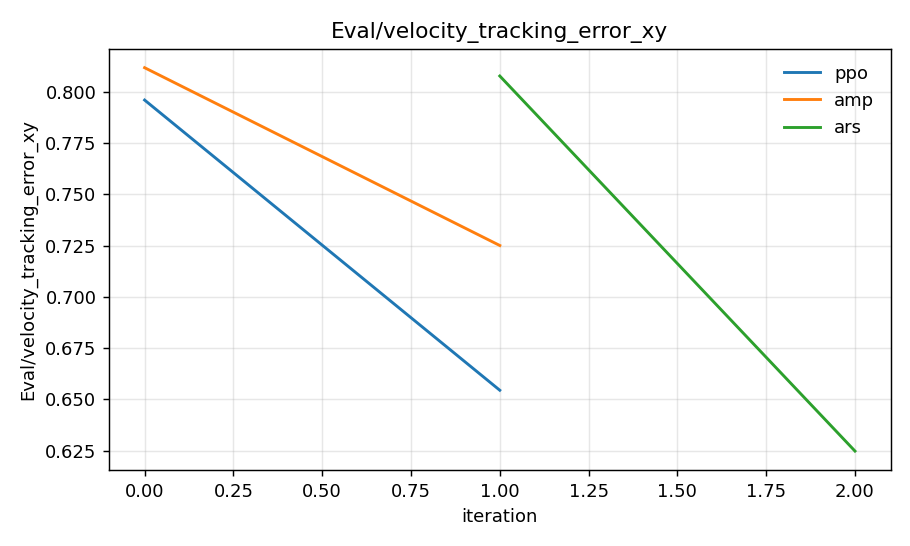
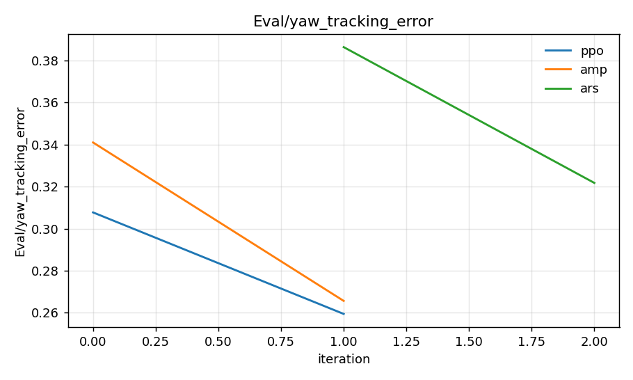
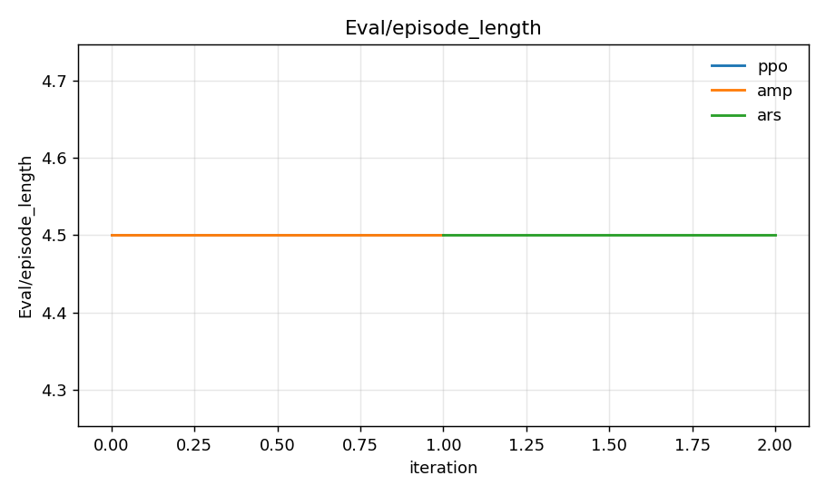
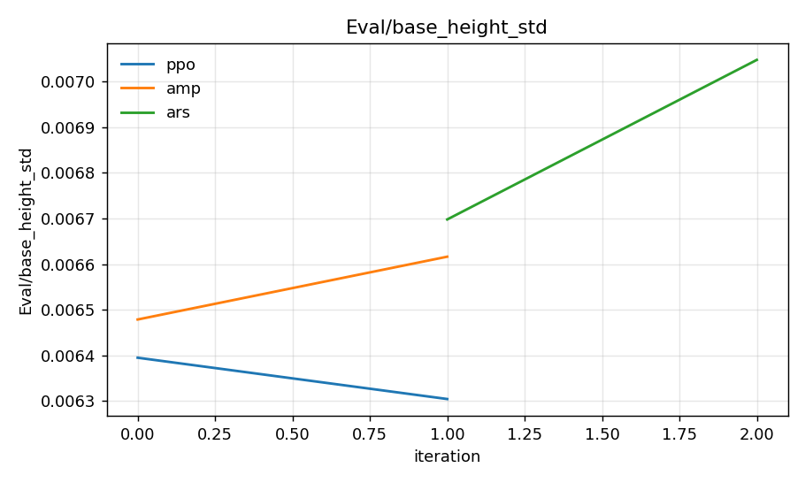
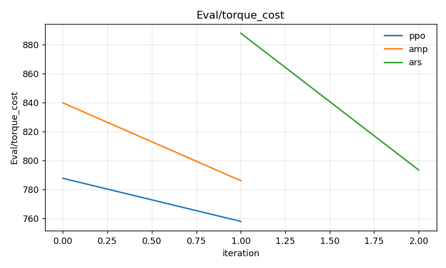
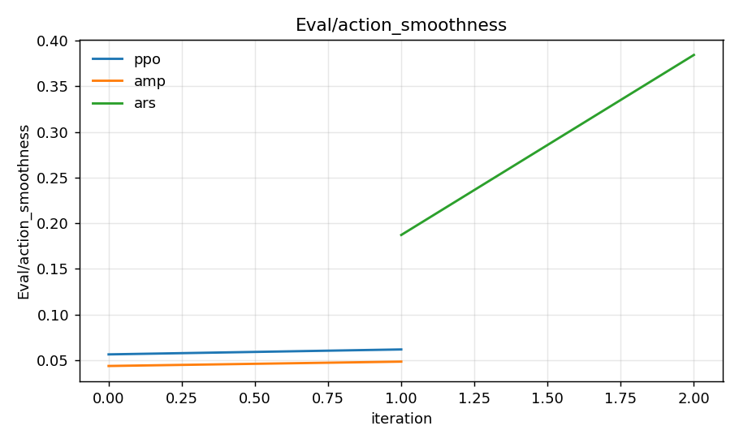
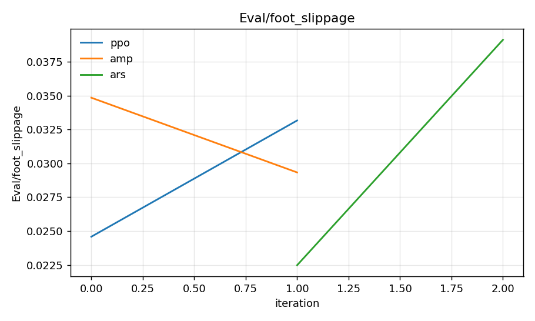
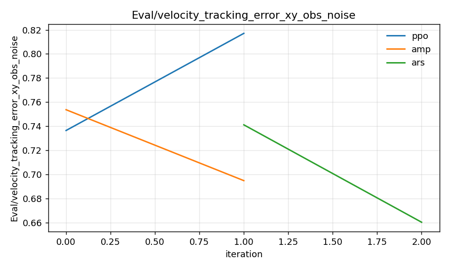
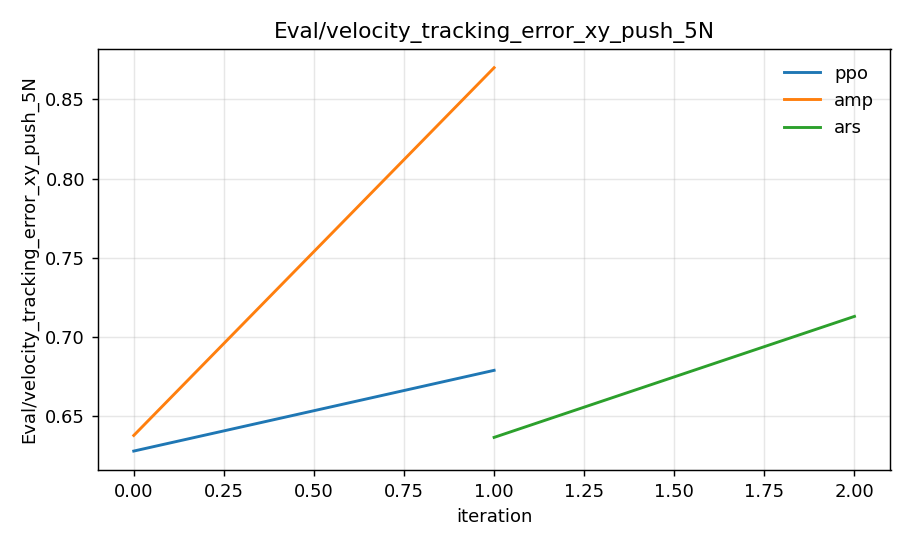
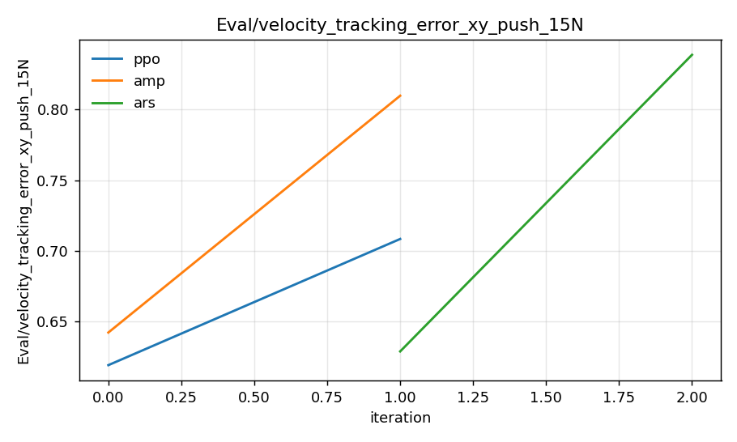

# Locomotion-on-G1 RL Algorithms — Comparison Report

> Phase 4 deliverable of `docs/algorithm_comparison_roadmap.md`.
> Numbers and figures in this document are auto-populated by `otus-extract-tb`
> from the TensorBoard event files of the runs listed in §3 — re-running the
> extractor after a fresh training overwrites everything in place.

## 1. TL;DR

This study compares three RL algorithm families on the same Unitree G1
velocity-tracking task in MuJoCo-Warp / `mjlab`:

| Family            | Algorithm   | What we expected                                                       |
| ----------------- | ----------- | ---------------------------------------------------------------------- |
| Deep on-policy    | **PPO**     | Strong baseline, smooth gait, decent robustness.                       |
| On-policy + adv.  | **PPO+AMP** | More natural gait, less hand-tuned style reward, possibly less robust. |
| Gradient-free     | **ARS**     | Cheap baseline; tells us how much "deep RL" actually buys us.          |

> **Headline:** see the table in §4 and the figure grid in §5.

## 2. Method

- **Task**: `Otus-G1-Walk-Compare` (PPO, ARS) and `Otus-G1-Walk-AMP` (PPO+AMP),
  which share an identical `ManagerBasedRlEnvCfg` so the numbers are directly comparable.
- **Robot**: Unitree G1 (29 DoF), joint-position action space through PD controllers.
- **Simulator**: `mjlab` / MuJoCo-Warp on a single GPU, 4096 parallel envs (PPO/AMP/ARS).
- **Eval harness**: `LocomotionCompareVelocityRunner` runs four eval passes every
  `--locomotion-eval-interval` PPO iters (or ARS iters) — nominal, observation
  noise, 5 N pelvis push, 15 N pelvis push — into 7 reward-independent scalars
  (see roadmap §4 for the exhaustive list).
- **AMP details**: LSGAN discriminator (`(s, sʹ) ∈ ℝ^{38}`, 2×{1024,512} MLP)
  with 1-sided gradient penalty on expert pairs; expert data is the LAFAN1
  `dance1_subject2` clip resampled from 30 → 50 fps. Style-shaping reward terms
  in the env are zeroed when AMP runs in *replace* mode.
- **Seeds**: 1 seed for the dev-iteration figures below. The roadmap budgets
  3-seed sweeps only for the final write-up; if those have been run, drop them
  in alongside the existing dirs and re-run `otus-extract-tb`.

## 3. Runs included

The figures and table below reflect the run directories listed in
`runs/compare/COMPARE-RUN-REPORT.md` (latest orchestrator output).
Re-generate the artifacts with:

```bash
otus-extract-tb \
    --run ppo=<PPO-run-dir> amp=<PPO+AMP-run-dir> ars=<ARS-run-dir> \
    --out-dir docs/results
```

(Or just `make compare-extract`, which auto-discovers the most recent run of each kind.)

## 4. Quantitative comparison (final-window mean)

The summary table is auto-generated to
[`tables/eval_summary.md`](./tables/eval_summary.md). It takes the mean of the
**last 10 %** of each metric's TB samples to reflect "converged" behaviour
without overweighting the very last data point.

> **Note**: For all `Eval/*_tracking_error*` and `Eval/*_cost`/`*_smoothness`/`*_slippage`
> metrics, **lower is better**. For `Eval/episode_length`, higher is better.

After running `otus-extract-tb`, copy or include the contents of
`docs/results/tables/eval_summary.md` here for a self-contained report:

<!-- BEGIN: paste contents of docs/results/tables/eval_summary.md here -->
<!-- END -->

## 5. Per-metric learning curves

Each PNG in `docs/results/figures/` overlays one curve per algorithm for a
single `Eval/*` tag. The most informative views:

### 5.1 Locomotion quality






### 5.2 Effort & smoothness





### 5.3 Robustness





> If a figure is missing, that metric did not have any samples in any of the
> runs — usually because eval-interval was set to `0` (smoke run). Re-train
> with `--agent.locomotion-eval-interval 50` and re-extract.

## 6. Per-algorithm pros / cons

> Update this section after looking at the figures and the summary table.

### PPO (deep on-policy baseline)

- **Pros**: …
- **Cons**: …
- **Failure modes**: …

### PPO + AMP

- **Pros**: …
- **Cons**: …
- **Notes**: AMP-specific scalars (`AMP/disc_loss*`, `AMP/disc_d_*_mean`,
  `AMP/r_amp_mean_last_step`) are exported to CSV alongside the `Eval/*` tags
  but not plotted by default — see `docs/results/csv/amp__AMP_*.csv` for the
  raw discriminator-training trajectory.

### ARS (gradient-free control)

- **Pros**: Trivial to implement (~150 LoC), single hyperparameter that matters
  (`noise_std`), no value function.
- **Cons**: …
- **Failure modes**: …

## 7. Honest limitations

- Single seed — not enough for statistical claims; treat the differences as
  ordinal, not significant.
- Single AMP expert clip (LAFAN1 `dance1_subject2`); a multi-clip dataset
  would likely change the AMP gait.
- All metrics are simulation-only; no sim2real gap analysis.
- No teacher-student, TD-MPC2, or DreamerV3 — explicitly out of scope
  (roadmap §9).

## 8. Reproducing this report

```bash
make up                                          # start the dev container
bash scripts/night_compare_orchestrator.sh       # ~12-15 GPU-hours, 1 seed each
make compare-extract                             # populates docs/results/
# then refresh the table in §4 from docs/results/tables/eval_summary.md
```

For a sub-2-minute end-to-end smoke test of the full pipeline (no training
to convergence, just verifying the orchestrator + extractor work):

```bash
bash scripts/night_compare_orchestrator.sh --smoke
make compare-extract-smoke
```

## 9. Artifacts checklist (Phase 4)

- [ ] `runs/compare/COMPARE-RUN-REPORT.md` — orchestrator's run-dir manifest
- [ ] `docs/results/csv/*.csv` — raw scalar series per run, per tag
- [ ] `docs/results/figures/*.png` — overlaid `Eval/*` curves
- [ ] `docs/results/tables/eval_summary.md` — final-window comparison table
- [ ] `docs/results/videos/` — N× side-by-side viewer captures (manual via `make play-viser`)
- [ ] ONNX exports per algorithm — copied from `<run_dir>/policy.onnx` (or
      re-exported with `otus-export`)
- [ ] This `comparison_report.md` filled in (§4 table pasted, §6 prose written)

## 10. Future work (not in this study)

- Phase 3 stretch: SAC via `skrl` — replay-buffer baseline. Code budget
  ~200 LoC; defer until Phase 4 numbers stabilize.
- Multi-clip AMP dataset (walk + turn + start-stop) for richer gait priors.
- Teacher-student distillation onto a partial-observation student (sim2real prep).
- Sim2real evaluation — would require partial-obs / domain-randomization setup.
